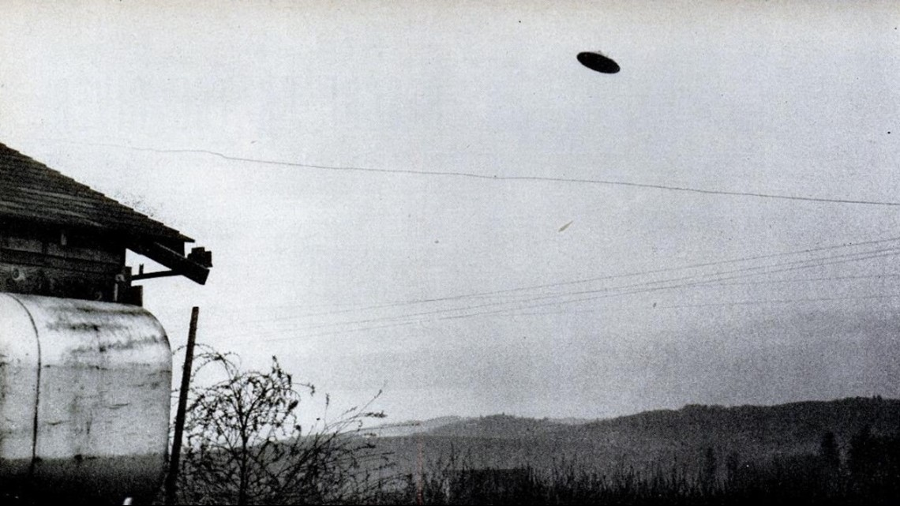
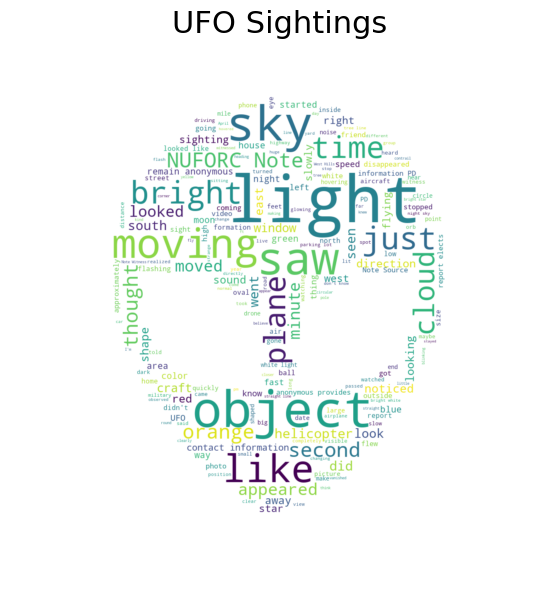
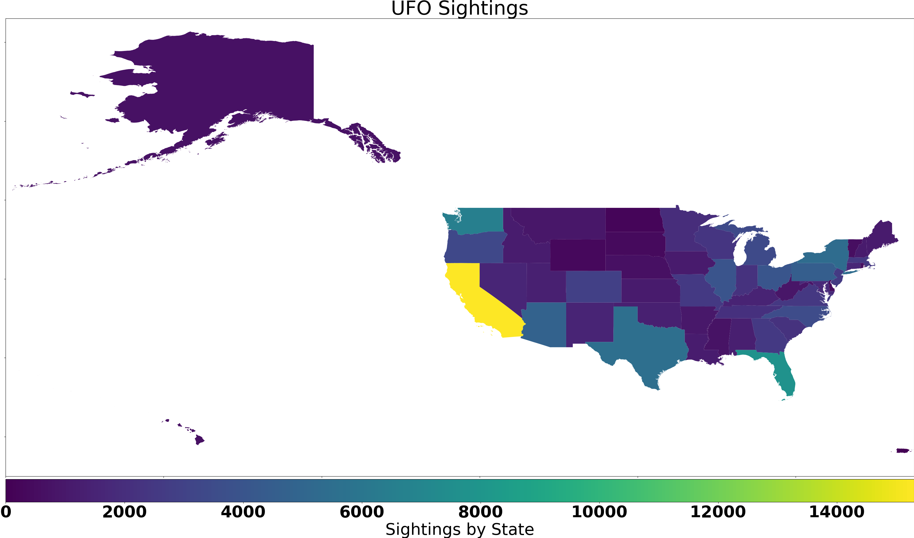

# It Came from Outer Space: Unsupervised Learning on UFO Sightings

## Background and Motivation

UFO sightings have enthralled the imagination since 1950. Observers can submit their stories to [The National UFO Reporting Center Online Database](http://www.nuforc.org/webreports.html), and we wanted to see if we could extract interesting patterns from them in an unsupervised context.

## Data Cleaning

The data consisted of sighting reports extracted from the [The National UFO Reporting Center Online Database](http://www.nuforc.org/webreports.html):

Note the two cells, the header with various tags and the long form description from the observer.

Our set was the raw HTML associated with We extracted the two cells of each report as strings via BeautifulSoup, putting the long form description as a primary field. We further broke down the first cell and extracted the tags, such as the `shape` of the sighting and `location` (which we further broke down into `state` and `city`), and compiled the whole thing into a Pandas Dataframe. Our row associated with the report above would be:

| Variable name     | Data type | Value                             |
|-------------------|-----------|-------------------------------------------------------|
| occured    | Datetime     | 5/1/2017                       |
| reported              | Datetime      | 5/2/2017 6:46:41 AM 06:46                                        |
| posted              | Datetime      | 5/6/2017                                         |
| city            | Text      | Taylor                                       |
| state               | Text      |  PA                                    |
| shape             | Text      | Other                                   |
| duration*        | Text      | 5 minutes                                  |
| report_text            | Text      | Ok so I was a skeptic until I was driving down main street.... |

(The `duration` field had various nonstandardized inputs, such as "5 minutes" and "10 second" and "minutes" (?). We attempted to standardize the inputs, but ultimately dropped the issue due to time constraints)

## EDA

We created a word cloud to check the most common words in our dataset. SKLearn's standard English Stop Words were used:

The resulting top six most common words are sky, object, light, time, saw, NUCFORC (NUCFORC is the National Unidentified Flying Object Reporting Center).

## K-Means Clustering

To gain insights about our text data, K-means clustering was applied to a TF-IDF vectorized matrix of our text corpus. After experimenting with the number of clusters, the top tokens for each centroid made the most sense when the number of clusters was set to 5.

|Centroid 1      | Centroid 2   | Centroid 3   | Centroid 4  | Centroid 5 |
| :------------- | :----------: | -----------: |-----------: |-----------:|
| saw            | lights       | object       | light       | provides     |
| like          | red           | moving       | bright       | elects        |
| sky            | sky         | sky           | sky         | anonymous      |
| craft          | craft       | appeared      | star        | information        |

Centroid 1+3 appear to be broad "moving sky object" categories sightings. Centroid 2 and 4 are more specific, with Centroid 2 corresponding to a red lighted craft and Centroid 4 corresponding to a _bright_ star like object. Centroid 5 seems to correspond with observers who wish to remain anonymous, or observers who have heard from government "informants" who wish to remain anonymous.

In the future, we probably want to expand our stop word list to exclude the common phrases that are non descriptive, such as "like" and "object", and remove common descriptors between centroids such as "light" and "bright".

## Choropleth 
We looked at the number of reported UFO sightings by state

In the future, we would like to normalize this graph by state population, because obviously #reports biases towards higher population states. That being said, we can see some states have significantly more reporting despite relatively smaller populations; Washington appears to have more reports than Texas despite having almost four times as fewer people, and Arizona appears to be the same. The raw data confirms this:

|State     | 2005 Population | Reported Incidents  
| :------------- | :----------: | -----------:
| Texas         | 22.8m | 5532                   | 
| Washington       | 6.3m | 6524             |
| Arizona        | 6.0m | 4722                     |
